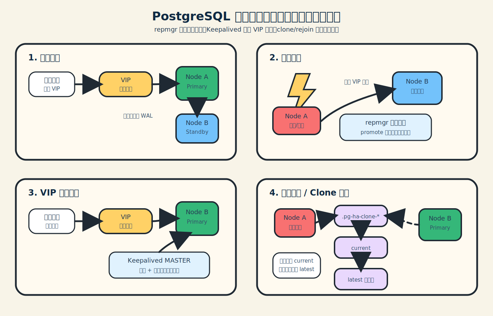

# PostgreSQL 高可用双机热备集群 (PostgreSQL 15.4 HA)

这是一个基于 `PostgreSQL 15.4` + `repmgr` + `Keepalived` 构建的工业级高可用架构。
只需修改简单的配置并在两台机器上启动 Docker，即可实现自动主备流复制、毫秒级数据同步、以及故障时的虚拟 IP (VIP) 自动漂移。

## 🌟 核心特性
1. **傻瓜式配置**：用户只需关心初始数据库名称、密码、机器IP 和 VIP，其他均自动化处理。
2. **自动故障转移 (Auto Failover)**：主节点宕机后，`repmgr` 自动将备节点拉升为主节点，`Keepalived` 仅在新主节点完成提升后接管 VIP，避免 VIP 早于数据库角色漂移。
3. **初始数据库自动创建**：支持启动时一键创建好您的业务数据库（如 `thingsboard`），开箱即用。
4. **自适应网络互信**：内部通过 `samenet` 配置网络互信，告别复杂的网段白名单。
5. **旧主自动回归为备库**：故障节点恢复后会检测对端是否已经成为新的主库，若已切主，则优先通过 `pg_rewind` 增量回归为 `standby`，仅在必要时才降级全量克隆，降低恢复时间与脑裂风险。

---

## 🖼️ 实现机制漫画图

下面这张图用四格漫画方式说明当前双机热备的核心链路：正常运行、主库故障、VIP 跟随新主、旧主恢复 / 全量 clone 保护。



---

## ✅ 测试场景总览

本项目已整理双机热备验收测试矩阵，覆盖主备启动、持续写入、正常停止、突然断电、双节点同时断电、旧主回归、全量 clone 失败保护、多次 clone 保留策略、VIP 顺序不变量、企业微信通知和日志可观测性。

- 测试场景总览：[docs/ha-test-scenarios.md](docs/ha-test-scenarios.md)
- 命令级完整用例：[docs/ha-failover-test-cases.md](docs/ha-failover-test-cases.md)
- 已知风险说明：[docs/known-risks.md](docs/known-risks.md)

---

## 🚀 极简部署指南

### 第一步：准备离线镜像与环境
由于本系统采用离线镜像交付，您需要先将构建好的镜像包 (`postgres-ha-v1.0.tar`) 传输到两台服务器上，并导入 Docker。

1. 假设两台服务器 IP 分别为 `192.168.1.11` (Node1) 和 `192.168.1.12` (Node2)，规划一个未被占用的虚拟 IP：`192.168.1.100` (VIP)。
> **注意：** 这三个 IP 必须在同一个物理局域网网段内。
2. 在两台机器上分别执行镜像导入：
   ```bash
   docker load -i postgres-ha-v1.0.tar
   ```

> **Docker Compose 兼容说明：**
> - Docker 新版本请使用 `docker compose`
> - Docker 旧版本请使用 `docker-compose`
> - 下文默认使用 `docker compose` 作为示例，如现场机器较旧，请将命令等价替换为 `docker-compose`

### 第二步：统一配置环境
在**两台机器**上都拉取本项目代码（或解压配置文件），并在两台机器的 `.env` 文件中填入**完全相同**的配置：
```env
# 虚拟 IP (VIP) - 供所有前端/应用直接连接的高可用统一 IP
NODE_VIP=192.168.1.100

# 初始业务数据库名称
POSTGRES_DB=thingsboard

# 业务数据库密码 (postgres 超级用户密码)
POSTGRES_PASSWORD=JvUcMbDxjYY4M8sj

# 企业微信切换通知（可选）
WECOM_NOTIFY_ENABLED=false
WECOM_WEBHOOK_URL=
WECOM_NOTIFY_SITE_NAME=xxxx现场
WECOM_NOTIFY_TIMEOUT=10
WECOM_NOTIFY_AT_ALL_ON_FAILOVER=false

# 当前机器的物理 IP (Node1 填 192.168.1.11，Node2 也填这个) 
# 注意：以下两个 IP 请根据您部署时的实际物理 IP 填写。
NODE_IP=192.168.1.11
PARTNER_IP=192.168.1.12
```
> **提示：** NODE_IP 必须是主节点机器的物理 IP，PARTNER_IP 必须是备用节点机器的物理 IP。**两台机器的 `.env` 文件内容完全一模一样即可**，不需要分别修改。

### 第三步：启动主节点 (Node1 服务器)
登录到第一台机器 (Node1)，执行以下命令启动主节点：
```bash
docker compose -f docker-compose-primary.yml up -d
```
旧版 Docker 写法：
```bash
docker-compose -f docker-compose-primary.yml up -d
```

### 第四步：启动备节点 (Node2 服务器)
登录到第二台机器 (Node2)，在 **Node1 启动成功后** 执行以下命令启动备节点：
```bash
docker compose -f docker-compose-standby.yml up -d
```
旧版 Docker 写法：
```bash
docker-compose -f docker-compose-standby.yml up -d
```

### 第五步：测试与验证
完成以上步骤后，您的应用代码只需连接 `192.168.1.100:5432`，使用用户 `postgres` 密码 `JvUcMbDxjYY4M8sj` 连接 `thingsboard` 数据库即可。

### 第六步：故障恢复行为说明
当主节点发生故障并由备节点自动接管后：

1. VIP 会在新主节点真正完成 `promote` 之后才漂移过去。
2. 原主节点恢复启动时，会先检测对端是否已经成为新的主节点。
3. 如果检测到对端已是主节点，原主节点会自动转为 `standby`，重新克隆并加入集群，而不会继续以旧主身份对外提供写服务。

### 第七步：企业微信通知（可选）
如果您希望在主备切换时收到企业微信群机器人通知，可在两台机器的 `.env` 中额外配置：

1. `WECOM_NOTIFY_ENABLED=true`
2. `WECOM_WEBHOOK_URL=您的企业微信群机器人 Webhook`
3. `WECOM_NOTIFY_SITE_NAME=现场名称`
4. 如需在自动故障切换时提醒群成员，可设置 `WECOM_NOTIFY_AT_ALL_ON_FAILOVER=true`

当前版本会在以下场景发送通知：
- 自动故障切换完成：显示当前主节点、VIP、可写状态、本机物理 IP
- 旧主重新加入为 Standby：显示当前主节点、只读待机状态、双节点拓扑已恢复

### 第八步：双节点同时断电后的恢复顺序
如果两台机器同时断电或同时宕机，推荐按以下顺序恢复：

1. 先启动最近一次的主节点。
2. 如果无法确认最后的主节点，优先启动您希望恢复为主节点的那台机器。
3. 当前版本会先识别本地数据目录的真实角色：
   - 如果本地数据目录是上次的 `primary`，且对端尚未恢复为 `primary`，本机会直接恢复为 `primary` 并接管 VIP。
   - 如果对端已经恢复为 `primary`，本机会自动以 `standby` 身份回归。
4. 等第一台机器恢复完成后，再启动另一台机器，它会自动重新加入集群。

经过回归测试，以下场景已经通过：
- 连续 3 轮主备切换后，集群仍可正常收敛。
- 双节点同时宕机后，`pg-node2` 先恢复、`pg-node1` 后恢复，最终可自动收敛为 `pg-node2=primary`、`pg-node1=standby`。

### 第九步：旧主恢复变慢的说明
如果现场出现“原主节点宕机后，备节点已升主，但旧主重新启动时恢复特别慢”的现象，当前版本优先按以下逻辑处理：

1. 旧主先检测本地数据目录真实角色。
2. 如果确认对端已经成为新的 `primary`，旧主会进入 `pg_rewind + node rejoin` 路径。
3. 只有在 `pg_rewind` 回归失败，或确实无法重新挂上新主时，才会降级为全量克隆。

当前版本已针对该场景做了两项修复：

1. 为 `repmgr conninfo` 显式补充 `application_name=<node_name>`，避免旧主回归后虽然已建立流复制，但 `repmgr` 无法在新主的 `pg_stat_replication` 中正确识别。
2. 将 `node_rejoin_timeout` 和 `standby_reconnect_timeout` 调整为 `180` 秒，降低旧主恢复时被过早误判为失败的概率。

最近一次完整回归中，除了第 1 轮旧主回归用时 `187s` 外，其余 5 轮旧主回归都稳定在 `4s~5s`，未再出现 `NODE REJOIN failed -> 全量 clone` 的误判链路。

> **详细的故障排查、主备切换等运维命令，请参阅 `docs/operations-guide.md`。**
